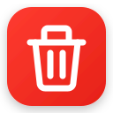

# YouTube Watch Later Cleaner

<p align="center">
  
</p>

<p align="center">
  <strong>Safely and effortlessly clear your entire YouTube Watch Later playlist with live progress, smart rate-pacing, and instant stop controls.</strong>
</p>

<p align="center">
  <a href="https://addons.mozilla.org/en-US/firefox/addon/watch-later-cleaner/"></a>
  <a href="https://github.com/madhusudan-kulkarni/youtube-watch-later-cleaner/releases/latest"></a>
  <a href="LICENSE"></a>
</p>

---

## 📖 About YouTube Watch Later Cleaner

YouTube does not provide a native button to clear or bulk-delete videos from your "Watch Later" playlist. If you have accumulated hundreds or thousands of saved videos, manually clicking the three-dot menu and selecting "Remove from Watch Later" for each one is tedious and time-consuming.

**YouTube Watch Later Cleaner automates the entire process directly in your browser:**

* 🚀 **One-Click Bulk Cleanup**: Sequentially removes every video from your Watch Later playlist automatically.
* 🏷️ **Live Toolbar Badge**: Displays live removal counts and status indicators (`⏳` cooldown, `✓` complete) right on the browser toolbar icon—even when switching tabs or closing the popup.
* 📊 **Smart Progress Tracking**: Detects total playlist count and renders a smooth percentage progress bar (`42 / 142 • 30%`).
* 🛡️ **Anti-Rate-Limit Pacing**: Safe delays between removals and a live-countdown 5-minute pause every 200 videos protect your account from YouTube rate limits.
* 🛑 **Instant Stop Control**: Stop anytime between removals; completed work is kept intact.
* 🔒 **100% Private & Local**: Zero tracking, zero telemetry, zero remote code. Run state lives entirely in `chrome.storage.session` and is wiped automatically when your browser closes.

---

## ⚡ Installation

### 🦊 Firefox
Install directly from the official Mozilla Add-ons store:  
👉 **[Get Watch Later Cleaner on Firefox Add-ons (AMO)](https://addons.mozilla.org/en-US/firefox/addon/watch-later-cleaner/)**

### 🌐 Google Chrome & Chromium (Brave, Edge, Opera)
1. Download `youtube-watch-later-cleaner-2.1.0-chrome.zip` from the latest **[GitHub Release](https://github.com/madhusudan-kulkarni/youtube-watch-later-cleaner/releases/latest)**.
2. Extract the `.zip` file to a folder.
3. Open `chrome://extensions/` (or `edge://extensions/`) and enable **Developer mode** in the top right.
4. Click **Load unpacked** and select the extracted folder.

---

## ✨ Features

| Feature | Description |
|---|---|
| 🎯 **One-Click Cleaning** | Cleans all videos sequentially from your active Watch Later playlist. |
| 🏷️ **Live Toolbar Badge** | Displays running removal count directly on the extension toolbar icon. |
| 📊 **Percentage Progress** | Automatically detects playlist total size and shows a deterministic progress bar. |
| ⏳ **Cooldown Countdown** | 5-minute safety pauses feature a live countdown timer in the popup. |
| 🛑 **Stop Anytime** | Aborts cleanly between removals without leaving the playlist in a corrupted state. |
| 🌐 **25+ Locales Supported** | Matches YouTube's context menu across 25+ languages (English, Spanish, German, French, Japanese, Korean, Hindi, Chinese, Portuguese, Italian, Russian, Turkish, Arabic, and more). |
| 🔄 **Interruption Detection** | Automatically detects tab closures or page reloads and reports status gracefully. |
| 🌓 **Dark & Light Mode** | Styled with YouTube's dark theme (light-mode aware) and accessible `aria-live` regions. |

---

## 🚀 How to Use

1. Open **[YouTube Watch Later Playlist](https://www.youtube.com/playlist?list=WL)** (`https://www.youtube.com/playlist?list=WL`).
2. Click the **Watch Later Cleaner** icon in your browser toolbar.
3. Click **Clean playlist** → **Start cleaning**.
4. Watch the progress climb or switch tabs—hit **Stop** whenever you like.

---

## ⌨️ Keyboard Shortcuts & Controls

| Action | Shortcut / Control | Scope |
|---|---|---|
| **Cancel / Dismiss** | <kbd>Escape</kbd> | Confirm view or Error modal |
| **Stop Cleaning** | Click **Stop** button | While cleaner is active |
| **Run Again** | Click **Run again** button | On completion view |

---

## 🛠️ Development & Build

### Prerequisites
- [Node.js](https://nodejs.org/) (v20+)
- [npm](https://www.npmjs.com/)

### Setup
```bash
# Clone the repository
git clone https://github.com/madhusudan-kulkarni/youtube-watch-later-cleaner.git
cd youtube-watch-later-cleaner

# Install dependencies
npm install

# Start development mode
npm run dev           # Chrome MV3
npm run dev:firefox   # Firefox MV2
```

### Build & Verify
```bash
npm run compile       # TypeScript typecheck
npm run lint          # ESLint
npm run build         # Production bundles for Chrome MV3 & Firefox MV2
npm run test          # Injected cleaner serialization sandbox tests
npm run zip           # Create store-ready .zip packages
```

---

## 📄 License

MIT © [Madhusudan Kulkarni](https://github.com/madhusudan-kulkarni)
